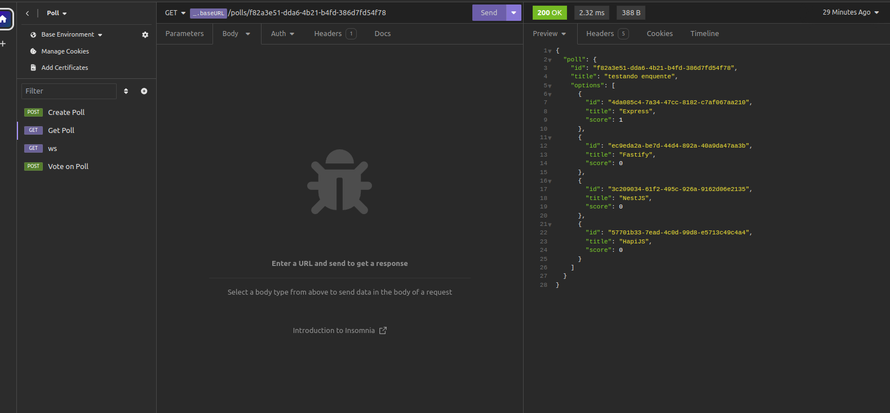
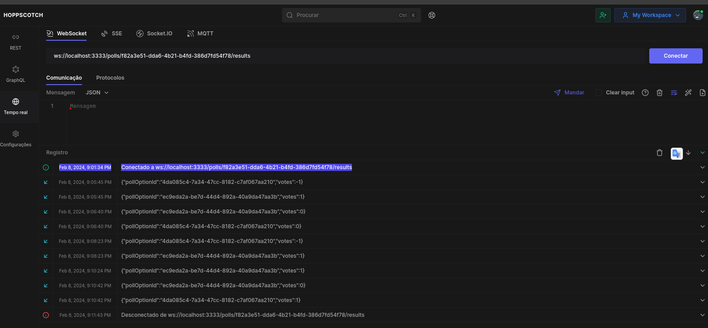

<p align="center">
  <h1 align="center">Project Built During NLW 2024 with 💜 at Rockeseat</h1>
  
  

  <!-- <p align="center">
    🔗 <a href="https://URLThisProject.com">https://URLThisProject.com</a> 🔗
  </p>   -->

  <!-- Write here what the project is about. -->
  <h1 align="center">About</h1>

## Backend da Aplicação

Nosso backend é uma API de votos desenvolvida em Node.js, com o Redis como banco de dados para armazenamento dos votos. Aqui está um resumo das principais características:

### Tecnologias Utilizadas

O backend foi construído utilizando Node.js, com as bibliotecas Fastify para criação do servidor web e WebSocket, e Prisma para interagir com o banco de dados PostgreSQL. Além disso, o Redis foi empregado como um banco de dados chave-valor para armazenar os votos em tempo real.

### Funcionalidades Principais

A API possibilita que os usuários votem em diversas opções de enquetes, mantendo a integridade dos votos por meio de identificação única dos usuários (usando cookies ou outra forma de identificação). Além disso, suporta atualizações em tempo real dos votos utilizando WebSocket, proporcionando uma experiência dinâmica para os usuários.

<!-- ### Regras da aplicação -->

🚧 Finished Project 🚧
[✅]

</p>

<!-- ## 🧭 Table of contents

- [🧭 Table of contents](#-table-of-contents)
- [🎥 Implementation Video](#-implementation-video)
- [🎨 Layout](#-layout)
- [👏 Learning and more Implementations](#-learning-and-more-implementations)
- [💡 Technologies Used](#-technologies-used)
- [📂 Folder Structure](#-folder-structure)
- [🚀 Running the Project](#-running-the-project)
  - [Back-end](#back-end)
  - [Front-end Web](#front-end-web)
  - [Mobile](#mobile)
- [📝 Routes](#-routes)
- [🌎 License](#-license)
- [✒ Author](#-author)

## 🎥 Implementation Video

In the GitHub edit, drag the video that it already puts on github itself.

## 🎨 Layout

Layout developed by [Name](https://www.instagram.com/urlName/)

[](https://www.figma.com/files)

## 👏 Learning and more Implementations

Describe what you learned and implemented in the project. -->

## 💡 Technologies Used

### NodeJS

### Fastify/websocket

### Prisma

### Fastify

### Ioredis

### Zod

- [x] [@fastify/cookie](https://www.npmjs.com/package/@fastify/cookie): ^9.3.1
- [x] [@fastify/websocket](https://www.npmjs.com/package/@fastify/websocket): ^8.3.1
- [x] [@prisma/client](https://www.npmjs.com/package/@prisma/client): ^5.9.1
- [x] [fastify](https://www.npmjs.com/package/fastify): ^4.26.0
- [x] [ioredis](https://www.npmjs.com/package/ioredis): ^5.3.2
- [x] [zod](https://www.npmjs.com/package/zod): ^3.22.4

<!--

## 📂 Folder Structure

```plainText
app
.
├── __tests__
├── android                     # Native android files
├── ios                         # Native ios files
├── src                         # Source files
│   ├── @types                  # Contains all global definitions of types and interfaces
│   ├── assets                  # Contains Js bundles assets. e.g: icons, splash, images etc...
│   ├── components              # Contains all global react components
│   ├── context                 # All contexts
│   ├── constants               # Constants files
│   ├── hooks                   # Cstomized hooks
│   ├── navigation
│   ├── screens
│   ├── services                # Contains external and api services
│   ├── App                     # Aplication entry
.
.
├── index                       # Bundle entry
.
.
└── README.md
```

## 🚀 Running the Project

### Back-end

Clone the project

```bash
  git clone https://link-para-o-projeto
```

Enter the project directory

```bash
  cd my-project
```

Install with dependencies

```bash
  npm install
```

Start the server

```bash
  npm run start
```

### Front-end Web

Clone the project

```bash
  git clone https://link-para-o-projeto
```

Enter the project directory

```bash
  cd my-project
```

Install with dependencies

```bash
  npm install
```

Start the server

```bash
  npm run start
```

### Mobile

Clone the project

```bash
  git clone https://link-para-o-projeto
```

Enter the project directory

```bash
  cd my-project
```

Install with dependencies

```bash
  npm install
```

Start the server

```bash
  npx expo start
```

- IOS:

```bash
  npx pod-install && npx react-native run-ios
```

- Android:

```bash
  npx react-native run-android
```

## 📝 Routes

[](https://app.getpostman.com/run-collection/link)
[](https://insomnia.rest/run/?label=NAMEPROJECT&uri=LINK)

## 🌎 License

This project is under the MIT license. See the [LICENSE](https://choosealicense.com/licenses/mit/) file for more details. -->

## ✒ Author

<p align="center">
  

  <h3 align="center">André de Souza</h3>
  
  <p align="center">  
    Done with love and faith not to give up 😅, get in touch!
  </p>
</p>  
  
<div align="center">

[](https://www.linkedin.com/in/andredessilva/)
[](mailto:seutecdev@gmail.com)
[](https://github.com/andreoew)

</div>
